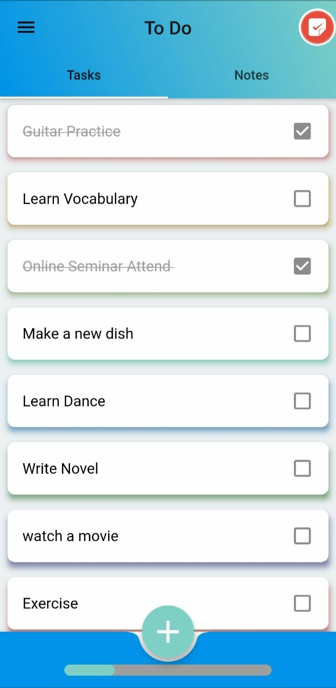
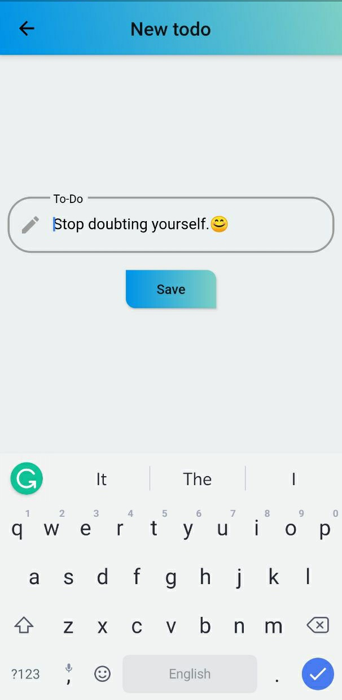
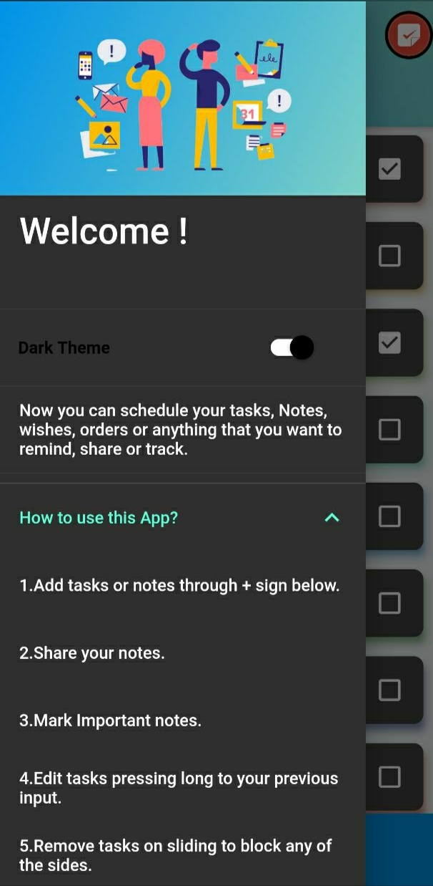
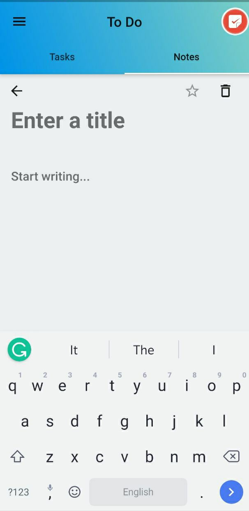
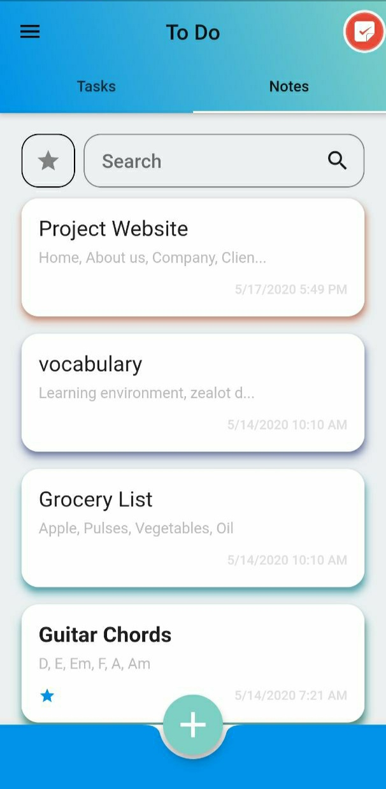

  

(Android/iOS)

<h1 align="center">ToDo Daily Task Planner, Tracker, Write Notes & Goal </h1>
<h3 align="center">Best app To Do Daily Task Planner, Activity Tracker, Write or make Notes & Goal.</h3>

Manage your daily tasks, master list by one of the best apps to finish your To Do Daily Task Planner, Activity Tracker, Write or make Notes & Goal effectively.

To Do task management app is a simple but user-friendly and effective app for managing your day to day tasks, keep a check on your targets and long term goals. It helps you to stay organized and focussed on your daily tasks and long term goals. To Do app helps you to accomplish your goals and keep track of them anywhere, anytime easily at the reach of your fingertips. There are a plethora of things you can do on To Do app like managing and tracking your daily routine works, making your bucket list, listing and managing your near term and long term future goals, maintaining your shopping lists, etc.

Accomplish the most meaningful tasks in your life whether on a daily basis or your future dreams just at the reach of your fingertips.

To Do app is easy to use, having customizable features like motivation to make your lists following emojis for fun, colored task planner, and comes with a dark theme, all with a behest of the user.  

<h4>⛑ Amazing To Do app features to organize you  </h4>

- A daily planner for your tasks.  
- Create and manage important notes.  
- Share your lists on any device with your friends, colleagues, and family.  
- Use To Do app for task management, bill reminder, maintaining shopping lists, and much more.  
- Create trip manuals writing places to visit.    
- Write quotes, give titles to your write ups.     
- Save messages or any write up.   
- Task management features, Segment or break your tasks into manageable steps.    
- Create online dairy to write your Homework, School Tasks, and office tasks.    
- Write dictations immediately on a project, save and share it with colleagues.    
- Divide your tasks into groups and make an individual list for all your tasks.    
- Create unlimited notes or tasks and differentiate these by names.    
- Best search filter to find your notes in a click.    
- Mark your notes favorite, and important and filter all important notes at once clicking on star icon.    
- Add, Edit, Delete Tasks, check on tasks by completion bar & checkbox.  

***⛑ How to use To Do App Manual?***

👉 Edit your current tasks by long press on the recent notes or lists.  
👉 Remove tasks on sliding to block any of the sides.  
👉 Differentiate your tasks by colors.   
👉 Add tasks through + sign below the To Do App.  
👉 Edit tasks pressing long to your previous input.    

I have added **About Us(FAQ Section)** in case you want to know more.    

 
   

---

## Screenshots

---

# My Tech stack and tools

In this repository you can find a list of tools, programming language and frameworks that I would use to build any kind of project.

Some of the tools listed I'm gaining experience like Flutter, Firebase etc through reading blogs and tutorials that made me think it would be a great choice for some type of project like this App.

- [My Tech stack and tools](#my-tech-stack-and-tools)
  - [Methodologies and core values](#methodologies-and-core-values)
  - [Application Development](#application-development)
  - [Development Tools](#development-tools)
    - [Tools](#tools-used)
    - [Documentation](#documentation)
    - [Testing](#testing)
  - [Design](#design)
  - [Marketing and Analytics](#marketing-and-analytics)
  - [Other Tools](#other-tools)
  
---
  
## Methodologies and core values

* [Modern Agile](http://modernagile.org/)
* Devops
* Continuous Delivery
* "Operate what you build" - [see](https://medium.com/netflix-techblog/full-cycle-developers-at-netflix-a08c31f83249)

---

## Application Development

* **Programming Language** - Dart, Java, Kotlin
* **Development Tool** - Flutter
* **Database** - sqflite
---

## Development Tools

### Tools Used

* [Flutter](https://flutter.dev/) 
  - Flutter is a framework for **Cross-Platform Development** on which we can make applications for both iOS and Android.
  - Flutter is Google’s UI toolkit for building beautiful, natively compiled applications for mobile, web, and desktop from a single codebase.
* [Firebase](https://firebase.google.com/) - A comprehensive app development platform support system in [Google Cloud Platform](https://cloud.google.com/).
  - [Firebase - Authentication](https://firebase.google.com/products/auth) - Authenticate users simply and securely.
  - [Firebase - Crashlytics](https://firebase.google.com/products/crashlytics) - Prioritize and fix issues with powerful, realtime crash reporting.
  - [Firebase - Performance Monitoring](https://firebase.google.com/products/performance) - Gain insight into your app's performance.
  - [Firebase - Remote Config](https://firebase.google.com/products/remote-config) - Modify your app without deploying a new version.
  - [Firebase - Predictions](https://firebase.google.com/products/predictions) - Smart user segmentation based on predicted behavior.
  - [Firebase - App Distribution](https://firebase.google.com/products/app-distribution) - Distribute pre-release versions of your app to your trusted testers.

### Documentation

* [Flutter - Docs](https://flutter.dev/docs) 
* [Firebase - Docs](https://firebase.google.com/docs)

### Testing 

* [Flutter Testing](https://flutter.dev/docs/testing) - Automated tests help ensure that your app performs correctly before you publish it, while retaining your feature and bug fix velocity.
* [Firebase - TestLab](https://firebase.google.com/products/test-lab) - Test your app on devices hosted in a Google data center.

---

## Design

* [Flutter - Cookbook](https://flutter.dev/docs/cookbook) 
* [Google Fonts](https://fonts.google.com/) - Google Fonts is a library of 991 free licensed font families.
* [Iconfinder](https://www.iconfinder.com/) - 2,775,000+ free and premium vector icons. SVG, PNG, AI, CSH and PNG format.

---

## Marketing and Analytics

* [Google Analytics](https://analytics.google.com/analytics/web/#/)
* [Google AdMob](https://admob.google.com/home/)
* [Google AdSense](https://www.google.com/intl/en_in/adsense/start/#/?modal_active=none)

---

## Deployment
Because of some problem i wasnt able to publish it on playstore for now , may be you can find it later on playstore bythe title above
For now I'm sharing the Apk Link:   

   

<h3>Building</h3>

Android Release: `flutter build apk` 

Android (arm64-v8a)/(armeabi-v7a): `flutter build apk --split-per-abi`  

If you have a connected device or emulator you can run and deploy the app with `flutter run` 

---
    
## Contributors

| 👤 **Sudhanshu Kushwaha**                                   | 👤 **Nirbhay Singh Naruka**                                              |
| ----------------------------------------------------------- | ---------------------------------------------------------------------- |
|Github: [@itssudhanshu](https://github.com/itssudhanshu)  | Github: [@nirbhaynaruka](https://github.com/nirbhaynaruka)   |
|LinkedIn: [@sudhanshu0299](https://linkedin.com/in/sudhanshu0299)  | LinkedIn: [@nirbhay13](https://www.linkedin.com/in/nirbhay13/)|

### :heart: Found this project useful?

If you found this project useful, then please consider giving it a :star: on Github and sharing it with your friends via social media.

